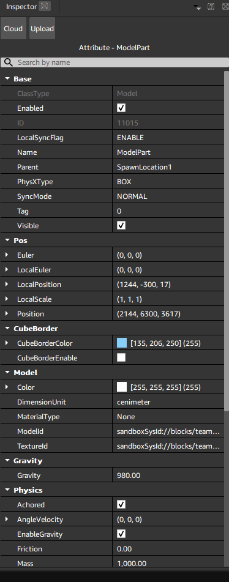
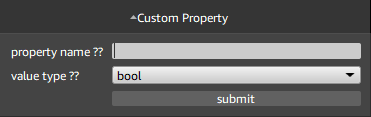

# 属性面板
  
用于编辑当前选中节点的各种属性，如位置，颜色等。
点击非灰色的属性可以编辑当前属性
点击分类或属性前方的箭头可以展开或折叠属性。

## 属性类型
**类型**|**说明**
---|---
数字|可以输入数字
字符串|可以输入文字
bool|可以勾选确认
数组|可以在展开后输入多组相同类型值 未展开时编辑暂时无效
颜色|类似数组类型 未展开时编辑暂时无效
资源|可以直接输入路径 点击后再次点击后方的三个点 可以选择上传资源或使用本地资源
节点|点击后可以从场景列表中选择目标节点
选项|可以从提供的多个选项中选择一个

## 自定义属性
在属性列表的最下方可以自定义属性
  
在此处新建自定义属性后可以在代码中使用该属性
选择新建的自定义属性可以重命名或移除属性